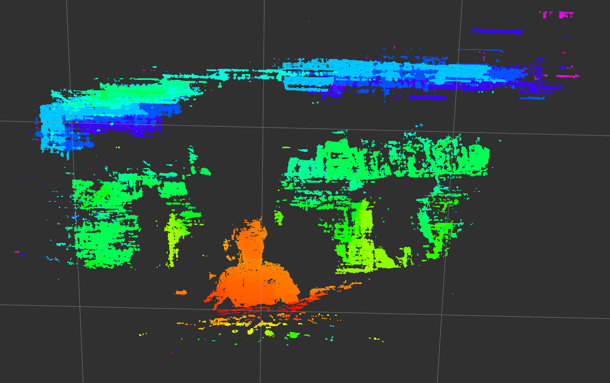

# OAK-D ROS Simple
+ OAK-D (OpenCV AI Kit camera) ROS simple codes with C++ for myself
+ Edited the original `depthai-ros-examples` repo from official manufacturer - [link](https://github.com/luxonis/depthai-ros-examples)
+ Supports: OAK-D, OAK-D Lite, OAK-D PRO

<br>

### Check the result video
#### Video1: [OAKD, OAKD-Lite, D435i](https://youtu.be/0Wla_efIOn0)
#### Video2: [OAKD-PRO, OAKD-Lite, D435i](https://youtu.be/t-4HMUlV5pQ)
#### Video3: [OAK-D Pro depth after filter parameters got tuned](https://youtu.be/I4n7haVlMug)

  <p align="left">
  
  </p>
  
<br>
<br>

## Requirements
+ `pcl`
+ `OpenCV`, `cv_bridge`: manual install? refer here [`OpenCV`](https://github.com/engcang/vins-application#-opencv-with-cuda-necessary-for-gpu-version-1), [`cv_bridge`](https://github.com/engcang/vins-application#-cv_bridge-with-built-opencv-necessary-for-whom-built-opencv-manually-from-above)
+ `usb-1.0-0-dev`
~~~shell
$ sudo apt install libusb-1.0-0-dev
~~~

<br> 

## How to install

+ Git clone and install `depthai-core` first

```shell
$ cd ~/<your_workspace>/src
$ git clone --recursive git@github.com:engcang/oakd-ros-simple

$ rm -r ~/.hunter

$ cd oakd-ros-simple/depthai-core
$ mkdir build && cd build
$ cmake .. -DBUILD_SHARED_LIBS=ON

$ make install
```

+ Build this repo

```shell
$ cd ~/your_workspace (check directory)

$ catkin build -Ddepthai_DIR=<your_workspace>/src/oakd-ros-simple/depthai-core/build/install/lib/cmake/depthai

or

$ catkin config -Ddepthai_DIR=<your_workspace>/src/oakd-ros-simple/depthai-core/build/install/lib/cmake/depthai
$ catkin build
```

<br> 

## How to run

+ Change the parameters in the `.launch` file.
~~~shell
$ roscore
$ roscd oakd_ros && rviz -d rviz.rviz
$ roslaunch oakd_ros main.launch
~~~
